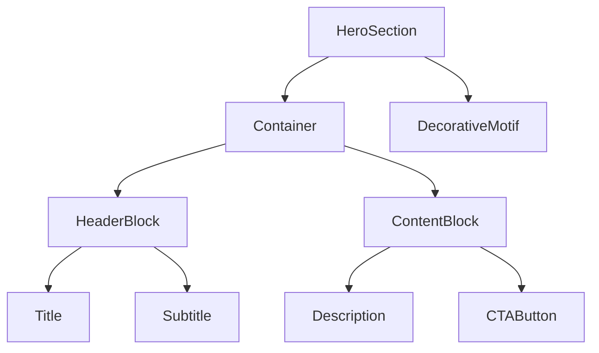

# capture-image — Figma情報の自動取得 → 構造化提案 → 確認 → 実装スキル

## このスキルがやること

Figma URL or スクリーンショット + 自由文の指示を受け取ったら、**いきなりコードに走らず**：

1. （Figma URL が提示されていれば）Figma Dev Mode MCP で実測値・変数・スクショを自動取得
2. 「セクション分解 → レイアウト視覚図（PC/SP） → クラス名 → 寸法（fluid込み） → SP対応 → ファイル構成」をMarkdownで構造化提案
3. ユーザーの "GO" 合意後に初めて実装

プロジェクト規約（fluid() / CSS変数 / Component 3点セット）を厳守する。

**重要:** 提案フェーズでは**実コード（pseudo-JSX 含む）は書かない**。要素の親子関係は構造ツリー、平面配置はレイアウト視覚図で表現する。

---

## 動作フロー（4フェーズ）

### フェーズ0: Figma 情報の自動取得（URL がある時のみ）

ユーザーが Figma URL を提示している場合に実行。詳細手順は `.claude/rules/figma-mcp-workflow.md` を必ず読んでから動く。

要点だけ：
1. URL から nodeId 抽出（`?node-id=1-2` → `1:2`）
2. `mcp__figma-dev-mode__get_design_context` を呼ぶ（スクショ + 参考コード + 寸法メタが返る）
   - `artifactType: COMPONENT_WITHIN_A_WEB_PAGE_OR_APP_SCREEN`（単体セクション）or `WEB_PAGE_OR_APP_SCREEN`（ページ全体）
   - `clientFrameworks: "react,next.js"`, `clientLanguages: "typescript,scss"`, `taskType: "CREATE_ARTIFACT"`
3. `mcp__figma-dev-mode__get_variable_defs` で使用変数（色/フォント/寸法トークン）を取得し、既存 `--color-*` 等にマップ
4. （補助）必要なら `mcp__figma-dev-mode__get_screenshot` で純粋なスクショ取得
5. **上下の隣接セクションの Group ノードも `get_metadata` で取得**し、セクション間ギャップ（上下）の Figma 値を算出しておく。詳細は `.claude/rules/section-spacing.md`

取得した実測値はフェーズ1の④寸法表の **max列** にそのまま反映する。min値はルールテーブル算出（フェーズ1で実施）。

**URL が無い・MCP接続失敗時:** 画像ベースの推定にフォールバックし、Figma URL があれば後で渡してほしいことだけ一度伝える（しつこく聞かない）。

### フェーズ1: 構造化提案（コード書かない）
画像 or フェーズ0取得情報と指示を解析し、後述の **8ブロック必須テンプレート** をすべて埋めてMarkdown出力する。
この時点で `.tsx` `.scss` のファイル作成は禁止。提案のみ。

### フェーズ2: ユーザー判断待ち
提案末尾に必ず以下を記載:

> **修正したい点があれば指示してください。問題なければ "GO" と返してください。**

- 修正要求が来たら → 該当ブロックだけ更新して再提示（全文再掲はしない、差分明示）
- "GO" / "OK" / "進めて" / "実装して" 等の同意語を受領するまで実装には進まない

### フェーズ3: 実装
GO受領後にのみ実行。
1. `.claude/rules/coding-standards.md` `.claude/rules/responsive.md` `.claude/rules/design-tokens.md` を読み直して規約を再確認
2. Component 3点セットを作成
   - `src/components/ui/{ComponentName}/{ComponentName}.tsx`
   - `src/components/ui/{ComponentName}/{ComponentName}.module.scss`
   - `src/components/ui/{ComponentName}/index.ts`
3. SCSSファイル先頭に必ず:
   ```scss
   @use '@/styles/fluid' as *;
   @use '@/styles/breakpoints' as *;
   ```
4. スケーラブルな値はすべて `@include fluid(プロパティ, min, max);`
5. 色は必ず `var(--color-xxx)` （ハードコード禁止）
6. **上下の隣接セクションとの余白を実測照合**: ブラウザ実測し、フェーズ0で算出した Figma のセクション間ギャップと一致するか確認。ズレていれば対象セクションの `padding-top` / `padding-bottom` で調整（`.claude/rules/section-spacing.md`）
7. 完了後に「作成ファイル一覧」「動作確認手順（npm run dev → 該当URL）」を返す

---

## フェーズ1で出力するMDテンプレート（必須8ブロック）

以下の8ブロックを **すべて埋めて** 出力する。空欄や省略は禁止。

```markdown
## 提案: {セクション名 / コンポーネント名}

### ① 構造ツリー
（ASCII or Markdownインデントで階層を可視化）
└── HeroSection
    ├── Container
    │   ├── HeaderBlock
    │   │   ├── Title (h1)
    │   │   └── Subtitle (p)
    │   └── ContentBlock
    │       ├── Description
    │       └── CTAButton
    └── DecorativeMotif

### ② レイアウト視覚図（PC / SP）

**目的:** 「どの要素が、どこに、どう並んでいるか」を一目でわかる平面図で示す。pseudo-JSX は書かない。
**形式:** ASCIIボックス図（PC + SP の2枚）必須 + Mermaid階層図（任意・補助）。

**PC（≥1024px）:**
```
┌──────────────────────────────────────────────────────────────┐
│ HeroSection                                                  │
│ ┌──────────────────────────────────────────────────────────┐ │
│ │ Container                                                │ │
│ │ ┌──── HeaderBlock ─────┐                                 │ │
│ │ │ Title (h1)           │                                 │ │
│ │ │ Subtitle             │                                 │ │
│ │ └──────────────────────┘                                 │ │
│ │ ┌──── ContentBlock ────────────────────────────────────┐ │ │
│ │ │ Description                                          │ │ │
│ │ │ [ CTAButton ]                                        │ │ │
│ │ └──────────────────────────────────────────────────────┘ │ │
│ └──────────────────────────────────────────────────────────┘ │
│                                          [ DecorativeMotif ] │
└──────────────────────────────────────────────────────────────┘
```

**SP（<768px）:**
```
┌────────────────────────┐
│ HeroSection            │
│ ┌────────────────────┐ │
│ │ Container          │ │
│ │ ┌────────────────┐ │ │
│ │ │ Title          │ │ │
│ │ │ Subtitle       │ │ │
│ │ └────────────────┘ │ │
│ │ ┌────────────────┐ │ │
│ │ │ Description    │ │ │
│ │ │ [ CTAButton ]  │ │ │
│ │ └────────────────┘ │ │
│ │ DecorativeMotif    │ │
│ │   → display:none   │ │
│ └────────────────────┘ │
└────────────────────────┘
```

**Mermaid階層図（任意・複雑な階層がある時のみ追加）:**


**作図ルール:**
- 横並び要素は **左右に並べて** 描く（`┌──┐ ┌──┐`）
- 縦積み要素は **上下に並べて** 描く
- グリッド要素は `┌──┐┌──┐┌──┐` を行で並べる
- 非表示・display:none は `→ display:none` と注記
- absolute 配置は `[要素名]` のように **角括弧 + 位置注記**（右上 / 中央 等）
- ボタンは `[ Label ]` で囲み、リンクは `<a> Label </a>` で囲む
- 入れ子の階層は枠を入れ子にする（PC は枠線3層程度まで、それ以上は Mermaid に逃がす）

### ③ クラス名一覧
| 要素 | クラス名 (camelCase) | 役割 |
|------|---------------------|------|
| ルート | heroSection | セクション枠 |
| 内側ラッパー | container | 最大幅・中央寄せ |
| 見出しブロック | headerBlock | タイトル + サブタイトル群 |
| ... | ... | ... |

### ④ レイアウト寸法表（Figma実測 → fluid()）
| プロパティ | 要素 | max値（Figma実測） | min値（算出） | コード |
|---|---|---|---|---|
| padding-top | heroSection | 200 | 60 | `@include fluid(padding-top, 60, 200);` |
| padding-inline | container | 200 | 20 | `@include fluid(padding-inline, 20, 200);` |
| font-size | title | 64 | 32 | `@include fluid(font-size, 32, 64);` |
| line-height | title | 1.2 | 1.2 | `line-height: 1.2;` （無次元はそのまま） |
| gap | contentBlock | 40 | 16 | `@include fluid(gap, 16, 40);` |
| ... | ... | ... | ... | ... |

> max値: フェーズ0で Figma MCP から取得した実測値を優先。URL未提示や接続失敗時のみ画像目視で推定。
> min値の算出は `.claude/rules/responsive.md` のテーブルに従うこと。

### ⑤ 色・フォント参照（必ずCSS変数表記）
- 見出し: `color: var(--color-black); font-family: var(--font-en); font-weight: var(--font-weight-light);`
- 本文: `color: var(--color-black); font-family: var(--font-primary);`
- アクセント / ホバー: `color: var(--color-primary);`
- 背景: `background-color: var(--color-white);`
- ハードコード（`#140700` など）は禁止

### ⑥ SP対応プラン（768px未満）
- レイアウト: 2カラム（contentBlock）→ `@include sp { flex-direction: column; }`
- 非表示: 装飾モチーフ（DecorativeMotif）は `@include sp { display: none; }`
- フォント: fluid()で自動スケール、追加調整不要
- absolute配置: `@include sp { position: relative; top: auto; }`
- 画像: SP用差し替えがあれば `<picture>` か CSS background-image で出し分け

### ⑦ ファイル構成
- `src/components/ui/HeroSection/HeroSection.tsx` — レンダリング・props定義
- `src/components/ui/HeroSection/HeroSection.module.scss` — スタイル一式
- `src/components/ui/HeroSection/index.ts` — `export { HeroSection } from './HeroSection';`

### ⑧ コンテンツ照合チェックリスト + 実装上の注意点

**🚨 必須：寸法だけでなく以下も Figma と1個ずつ突き合わせる（Phase 4 で漏らした項目）**

- [ ] **写真・画像ソース**: Figma の画像が既存リポジトリと**同一かどうか**必ず確認。違うなら Figma からダウンロードして `public/` に配置 → data 側のパス更新
- [ ] **テキスト本文**: 引用文 / 紹介文 / 経歴等が Figma の文言と一致するか。既存データが `"ここに簡易的な説明文が入ります"` 等のプレースホルダーのままになっていないか
- [ ] **リンク・SNS**: INSTAGRAM / X / その他リンクの有無と URL（Figma にあって既存になければ追加、逆もしかり）
- [ ] **要素の有無**: Figma側にあって既存実装にないもの、その逆も洗い出す
- [ ] **配置・並び順**: 既存と Figma で並び順が違うケース（例: SNSが右上 vs 左下）

> ⚠️ 照合せずに寸法・フォントだけ合わせると「ピクセルパーフェクト判定」が誤る（Phase 4 で写真齟齬・本文齟齬を見落とし）。
> 既存のデータ・画像を流用する時は **必ず Figma と突き合わせて差分を明示** すること。

**実装関連:**
- データソース: ハードコード or `src/data/...` に分離するか（要相談）
- 画像配置: `public/images/sections/...` （命名規則は kebab-case）
- アニメーション: GSAPでフェードイン → useEffect + ScrollTrigger 想定
- 3D連動: 不要 / `src/components/three/...` のキャラクターと位置合わせが必要 等
- アクセシビリティ: `aria-label` / 見出しレベル（h1〜h6）の階層

---
**修正したい点があれば指示してください。問題なければ "GO" と返してください。**
```

---

## フェーズ2の挙動（GO待機・修正受け付け）

- 一度提案を出したら、ユーザーの返答を待つ
- 修正指示の例:
  - 「タイトルを h2 にしたい」 → ② / ③ を更新
  - 「padding もうちょい狭く」 → ④ を更新（max値を Figma再確認 or 縮小値で再提案）
  - 「SPでは Subtitle 隠したい」 → ⑥ を更新
- 修正後は **更新したブロックだけ** を再提示（差分が分かるように見出しに `(更新)` を付ける）
- 「GO」「OK」「いいよ」「進めて」「実装して」のいずれかを受け取って初めてフェーズ3へ
- 曖昧な返事（「うーん」「どっちがいい？」等）は確認質問を返してフェーズ2を継続

---

## フェーズ3の実装ルール（プロジェクト規約厳守）

詳細は以下を必ず読んでから実装すること:
- `.claude/rules/coding-standards.md` — Component 3点セット、フォント、ホバー
- `.claude/rules/responsive.md` — fluid() の使い方、min値算出テーブル
- `.claude/rules/design-tokens.md` — 確定済みCSS変数の一覧

### 必須チェックリスト
- [ ] `ComponentName/` フォルダに3ファイル揃ってる（tsx + module.scss + index.ts）
- [ ] SCSSの先頭に `@use '@/styles/fluid' as *;` `@use '@/styles/breakpoints' as *;`
- [ ] スケーラブル値はすべて `@include fluid(prop, min, max);`（固定px禁止）
- [ ] 色は `var(--color-xxx)` 経由（カラーコード直書き禁止）
- [ ] 横並びレイアウトには `@include sp { flex-direction: column; }` がある
- [ ] absolute 配置には SP時の `position: relative; top: auto;` がある
- [ ] ホバーは `color: var(--color-primary)` + `transition: color var(--transition-base)`
- [ ] tsx は named export、index.ts で再エクスポート
- [ ] 上下の隣接セクションとの余白が Figma のセクション間ギャップと一致（`.claude/rules/section-spacing.md`）

### 実装後に返す情報
- 作成ファイルの絶対パス一覧
- 動作確認手順:
  1. `npm run dev`
  2. `http://localhost:3000/{ページパス}` を開く
  3. ブラウザDevToolsで320px / 768px / 1200px の3点で見た目崩れがないか確認

---

## アンチパターン警告（教え子が陥りやすいミス）

1. **提案フェーズをスキップして即実装** — 画像見た瞬間にコード書き始めるのはNG。必ず8ブロック提案 → GO待ち。
1-b. **② に pseudo-JSX を書く** — JSXタグや `className={styles.xxx}` を書きそうになっても禁止。視覚レイアウト図（ASCII / Mermaid）で代替する。実装はフェーズ3でやる。
2. **固定pxで余白を書く** — `padding: 80px;` はNG。`@include fluid(padding, 32, 80);` が正解。
3. **カラーコード直書き** — `color: #140700;` はNG。`color: var(--color-black);` が正解。
4. **Component 3点セット崩し** — `tsx` だけ作って `index.ts` を作り忘れる、`module.scss` を共通スタイルに混ぜる等はNG。
5. **横並び要素のSP対応忘れ** — `display: flex` だけ書いて `@include sp { flex-direction: column; }` を書き忘れるとSPで横スクロールが出る。

---

## 使用例

### 例1: 新規セクション実装依頼
```
ユーザー: [Figmaスクショ添付] 「ヘッダー下のヒーローセクションを実装したい」

→ スキル発動
→ フェーズ1: 8ブロック提案を出力（HeroSectionの構造、寸法表、SP対応プラン等）
→ 末尾に「修正したい点があれば〜」

ユーザー: 「タイトルを h2 にして、SP時は Subtitle 隠したい」

→ フェーズ2: ② と ⑥ のブロックを (更新) として再提示

ユーザー: 「GO」

→ フェーズ3: src/components/ui/HeroSection/ に3ファイル作成
→ 動作確認手順を返却
```

### 例2: 部分UI実装
```
ユーザー: [Figmaスクショ添付] 「このボタン部分だけ起こして」

→ スキル発動
→ 既存の Button コンポーネントを拡張すべきか、新規 CTAButton を作るか確認
→ 8ブロック提案（小さなコンポーネントでもブロックは省略しない、N/A は明記）
→ GO 受領後に実装
```

### 例3: Figma URL を渡されたケース（推奨フロー）
```
ユーザー: 「https://figma.com/design/xxx/?node-id=122-128 のヒーロー実装して」

→ スキル発動
→ フェーズ0: URL から nodeId=122:128 を抽出
  - mcp__figma-dev-mode__get_design_context (artifactType=COMPONENT_WITHIN_A_WEB_PAGE_OR_APP_SCREEN)
  - mcp__figma-dev-mode__get_variable_defs
  → 実測寸法 + 使用変数を収集
→ フェーズ1: 8ブロック提案。④寸法表の max列は MCP 実測値で埋める
→ フェーズ2: ユーザー判断
→ フェーズ3: GO 受領後に3点セット作成
```
