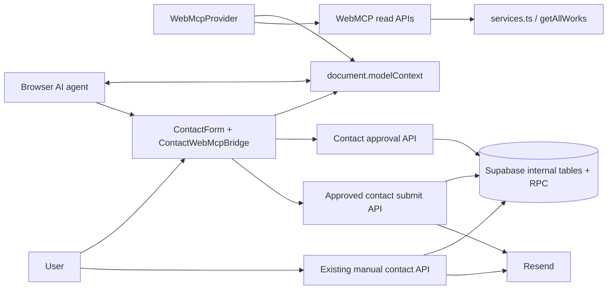
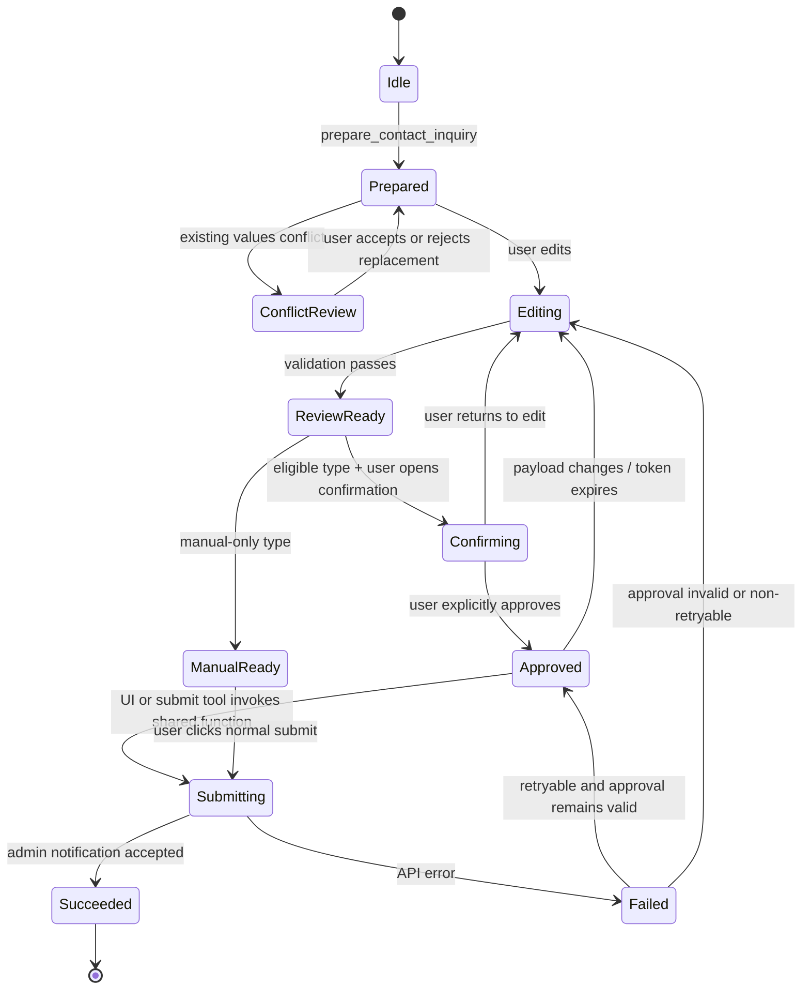
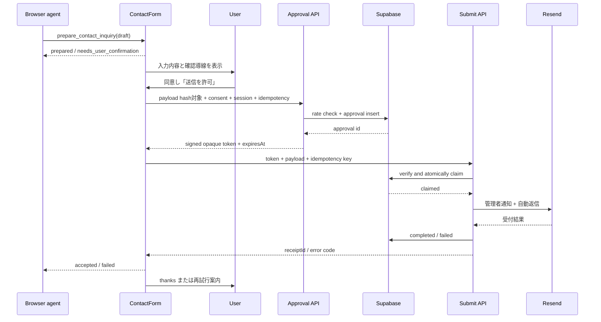

# WebMCP 導入 設計書

| 項目 | 内容 |
|---|---|
| 対象システム | 株式会社アリガトサン コーポレートサイト |
| 対象リポジトリ | `arigatosun/arigatosun_hp` |
| 文書バージョン | 1.1 |
| 作成日 | 2026-08-27 |
| 文書ステータス | 実装反映済み・本番公開ゲート未実施 |
| 上位文書 | `docs/WEBMCP_REQUIREMENTS.md` v1.1 |
| 対象工程 | 実装、DB マイグレーション、テスト、Origin Trial、本番運用 |

---

## 1. 本書の目的

本書は、`docs/WEBMCP_REQUIREMENTS.md` で定義した要件を、現行サイトの Next.js、React、Supabase、Resend および Vercel 構成へ実装するための内部設計を定義する。

以下を実装担当者が追加判断なしで着手できる粒度まで具体化する。

- 現行実装の再利用範囲と変更箇所
- WebMCP ツールの登録方式とライフサイクル
- コンポーネント、hook、型、API の責務
- 問い合わせフォームの状態遷移
- 明示承認、改ざん防止、重複送信防止
- Supabase テーブル、RPC、RLS、保持期間
- 機能フラグ、Origin Trial、監視、停止方式
- テスト構成と要件・受入基準の対応

## 2. 現行実装の確認結果

### 2.1 システム構成

| 領域 | 現行実装 | 設計判断 |
|---|---|---|
| フレームワーク | Next.js 16.3.3 App Router、React 19.2.3 | セキュリティ修正版へ更新して継続利用 |
| 言語 | TypeScript strict | 継続利用 |
| 公開レイアウト | `src/app/(site)/layout.tsx` | 共通 WebMCP Provider の配置先として利用 |
| 管理レイアウト | `/admin` は `(site)` を経由しない | 管理画面へのツール露出防止に利用 |
| サービス情報 | `src/data/services.ts` の `SERVICE_CARDS` | サーバー API から読み取る |
| 実績情報 | `src/data/works.ts` の `getAllWorks()` | 検索 API の唯一のデータアクセス層として利用 |
| 問い合わせ UI | 約 400 行の controlled form | state を維持しつつ責務分割する |
| 問い合わせ API | `POST /api/contact`、Resend 2 通送信 | メール送信処理を共通 service へ抽出する |
| スパム対策 | ハニーポット、2 秒判定、インメモリ IP 制限 | 手動送信は維持し、自動送信は専用承認経路を追加 |
| 分散制限 | アリガトくん用 Supabase RPC の実績あり | 同じ設計パターンで問い合わせ用 RPC を新設 |
| 管理 DB 接続 | `createAdminClient()` + `server-only` | WebMCP 内部テーブルへの接続に再利用 |
| 分析 | GTM、GA4、Clarity。オプトアウト対応 | PII を含まない専用イベント helper を追加 |
| テスト | Playwright は導入済み、単体テスト基盤なし | Vitest と Testing Library を追加 |
| デプロイ | Vercel、`main` マージで本番反映 | Preview、固定 staging origin、本番の順で公開 |

### 2.2 再利用する現行資産

- `getAllWorks()` を実績の正規データアクセス層として維持する。
- `SERVICE_CARDS` をサービス情報の正規データソースとして維持する。
- `escapeHtml()` と Resend の管理者通知・自動返信ロジックを共通 service へ移設して再利用する。
- `createAdminClient()` を WebMCP 内部テーブルおよび RPC 呼び出しに利用する。
- `hashIp()` の思想を踏襲するが、問い合わせ専用 salt と関数へ分離する。
- Supabase の `security definer` RPC、service-role 限定、pg_cron 保持処理の既存パターンを踏襲する。
- Analytics のオプトアウト機構を維持する。
- Contact ページの既存バリデーション文言、アクセシビリティ属性、thanks ページへの遷移を維持する。

### 2.3 現行実装の変更が必要な点

| ID | 現状 | 必要な変更 |
|---|---|---|
| GAP-01 | 問い合わせ種別がない | 6 種別を型、UI、API、メールへ追加 |
| GAP-02 | クライアントとサーバーで検証処理が分散 | `src/lib/contact` に共通定義を集約 |
| GAP-03 | レート制限がプロセスメモリ内 | Supabase の原子的共有ゲートを追加 |
| GAP-04 | 2 秒未満を成功扱いで黙示破棄 | 承認済み WebMCP 経路では使用しない |
| GAP-05 | idempotency がない | DB の unique key と原子的 claim を追加 |
| GAP-06 | ユーザー承認の記録がない | PII を含まない承認レコードと署名 token を追加 |
| GAP-07 | WebMCP 型と登録基盤がない | `webmcp-types` と共通 hook を追加 |
| GAP-08 | 単体テスト実行環境がない | Vitest、Testing Library、scripts を追加 |
| GAP-09 | 実行時 kill switch がない | Supabase runtime config と API 判定を追加 |
| GAP-10 | プライバシーポリシーに WebMCP 記載がない | 法務・運用確認後に説明と版管理を追加 |

## 3. 設計原則

1. **Progressive Enhancement**：`document.modelContext` がない場合は完全な no-op とする。
2. **Native API only**：本番に WebMCP polyfill を導入しない。
3. **Server authority**：送信種別、承認、レート、重複防止は必ずサーバーで再判定する。
4. **Human in the loop**：AI は同意チェックを変更できず、送信前にユーザー操作を必須とする。
5. **PII minimization**：DB、ツール出力、分析イベントへ問い合わせ本文・連絡先を残さない。
6. **Legacy preservation**：通常フォームと WebMCP 承認済み送信を別経路にし、既存利用者への影響を限定する。
7. **Fail closed for automation**：承認 DB または runtime config の障害時、自動送信は拒否する。
8. **Small tool surface**：本番初期ツールを要件どおり 4 件に限定する。
9. **Lifecycle correctness**：ページ状態に応じて登録し、不要になったツールは `AbortSignal` で解除する。
10. **Future data source compatibility**：Client Component から静的データを直接 import せず、API 境界を維持する。

## 4. 主要設計判断

| ID | 判断 | 理由 |
|---|---|---|
| DD-01 | `document.modelContext` を直接使用 | 現行 WebMCP 仕様に合わせるため |
| DD-02 | `webmcp-types` を devDependency として固定 | DOM 型を正規パッケージで補完し、実行 bundle を増やさないため |
| DD-03 | 読み取りツールも Route Handler 経由 | 将来 `getAllWorks()` が CMS/外部 API 化しても Client を変えないため |
| DD-04 | `POST /api/contact` と WebMCP 自動送信を分離 | 既存手動送信の後方互換性と自動送信の厳格な allowlist を両立するため |
| DD-05 | 承認は DB レコード + HMAC 署名 token | PII を token に含めず、改ざん・期限・単回使用を検証するため |
| DD-06 | `submit_project_request` の token は closure に保持 | token を AI の引数・出力へ露出しないため |
| DD-07 | 送信 claim を Supabase RPC で原子的に行う | サーバーレスの同時実行でも重複を防ぐため |
| DD-08 | 問い合わせ PII を Supabase に保存しない | 現行運用がメール受付であり、追加の保存リスクを避けるため |
| DD-09 | runtime config を DB 管理 | デプロイやコード変更なしで自動送信を停止するため |
| DD-10 | UI approval と tool execute は同じ submit service を利用 | ブラウザエージェント差異に影響されず、一度のユーザー承認後に送信するため |

## 5. 全体アーキテクチャ



### 5.1 境界

- WebMCP はブラウザ上の Client Component でのみ登録する。
- 公開情報の取得、承認、送信は Route Handler を介する。
- service-role key、HMAC secret、IP salt はサーバー外へ出さない。
- `/admin` は `src/app/(site)/layout.tsx` を通らないため Provider を持たない。
- Origin Trial token は公開情報だが、環境変数からヘッダーへ配信する。

## 6. 変更後のファイル構成

```text
src/
├─ app/
│  ├─ (site)/
│  │  ├─ layout.tsx                              # WebMcpProvider を追加
│  │  └─ contact/
│  │     ├─ page.tsx                             # ContactForm の配置へ縮小
│  │     └─ components/
│  │        ├─ ContactForm/
│  │        │  ├─ ContactForm.tsx
│  │        │  ├─ ContactForm.module.scss
│  │        │  └─ index.ts
│  │        └─ ContactConfirmationDialog/
│  │           ├─ ContactConfirmationDialog.tsx
│  │           ├─ ContactConfirmationDialog.module.scss
│  │           └─ index.ts
│  └─ api/
│     ├─ contact/route.ts                        # 手動送信。共通 service 利用へ変更
│     └─ webmcp/
│        ├─ config/route.ts
│        ├─ services/route.ts
│        ├─ case-studies/route.ts
│        └─ contact/
│           ├─ approval/route.ts
│           └─ submit/route.ts
├─ components/
│  └─ layout/
│     └─ WebMcpProvider/
│        ├─ WebMcpProvider.tsx
│        ├─ WebMcpProvider.module.scss           # 視覚要素なしでも規約上作成
│        └─ index.ts
├─ data/
│  └─ privacy-policy.ts                          # 版定数と WebMCP 説明を追加
├─ lib/
│  ├─ contact/
│  │  ├─ constants.ts
│  │  ├─ types.ts
│  │  ├─ validation.ts
│  │  ├─ canonicalize.ts
│  │  ├─ email.ts
│  │  ├─ idempotency.ts
│  │  ├─ rate-limit.ts
│  │  └─ useContactWebMcp.ts
│  └─ webmcp/
│     ├─ types.ts
│     ├─ schemas.ts
│     ├─ api.ts
│     ├─ runtime-config.ts
│     ├─ approval-token.ts
│     ├─ audit.ts
│     ├─ analytics.ts
│     ├─ useLatest.ts
│     └─ useWebMcpTool.ts
├─ types/
│  └─ webmcp-reference.d.ts
└─ styles/
   └─ _variables.scss                            # 必要な状態色 token のみ追加

supabase/migrations/
├─ 20260827000000_webmcp_runtime_config.sql
├─ 20260827000100_webmcp_contact_security.sql
├─ 20260827000200_webmcp_retention.sql
└─ 20260827000300_webmcp_retention_cron.sql

tests/
├─ e2e/webmcp.spec.ts
└─ fixtures/webmcp-tool-selection.json

scripts/webmcp/
└─ evaluate-tool-selection.ts
```

`src/app/(site)/contact/components` はページ固有コンポーネントであるため、この位置とする。各コンポーネントはプロジェクト規約の 3 点セットを維持する。

## 7. TypeScript 型設計

### 7.1 WebMCP DOM 型

`webmcp-types` を devDependency に追加し、lockfile でバージョンを固定する。本書作成時の確認版は `0.1.5`。

`src/types/webmcp-reference.d.ts`：

```ts
/// <reference types="webmcp-types" />
```

`tsconfig.json` の `types` は指定しない。指定すると既存の暗黙型読込を制限するため、上記 reference file を `include` で自動読込させる。

### 7.2 問い合わせ型

```ts
export const INQUIRY_TYPES = [
  'project_request',
  'estimate_consultation',
  'sales_solicitation',
  'recruitment',
  'partnership',
  'media_other',
] as const;

export type InquiryType = (typeof INQUIRY_TYPES)[number];

export interface ContactFormData {
  inquiryType: InquiryType | '';
  company: string;
  name: string;
  nameKana: string;
  email: string;
  phone: string;
  message: string;
}

export interface PrivacyConsent {
  accepted: true;
  policyVersion: string;
}

export type SubmissionSource = 'manual' | 'webmcp';
```

### 7.3 実行ポリシー

`src/lib/contact/constants.ts` に唯一の正規定義を置く。

```ts
export const INQUIRY_POLICY = {
  project_request: { label: '制作・開発依頼', autoSubmit: true },
  estimate_consultation: { label: '見積・相談', autoSubmit: true },
  sales_solicitation: { label: '営業・売り込み', autoSubmit: false },
  recruitment: { label: '採用', autoSubmit: false },
  partnership: { label: '協業・パートナー', autoSubmit: false },
  media_other: { label: '取材・その他', autoSubmit: false },
} as const satisfies Record<InquiryType, {
  label: string;
  autoSubmit: boolean;
}>;
```

Client、Route Handler、メールテンプレート、テストはすべてこの定義を参照する。文字列の重複定義を禁止する。

### 7.4 API 共通 envelope

```ts
export type ApiSuccess<T> = { ok: true; data: T };

export type ApiFailure = {
  ok: false;
  error: {
    code: WebMcpErrorCode;
    message: string;
    retryable: boolean;
  };
};
```

PII をエラー、成功 payload、例外 message へ含めない。

## 8. WebMCP 登録基盤

### 8.1 `useWebMcpTool`

責務：

- `document.modelContext` の feature detection
- runtime flag の確認
- `registerTool()` の実行
- `AbortController` による解除
- 登録失敗の非 PII ログ
- 同名ツールの重複登録防止
- React Strict Mode の mount/unmount に耐えること

interface：

```ts
useWebMcpTool({
  enabled,
  definition,
  execute,
});
```

`execute` が form state を読む場合は `useLatest()` の ref 経由とし、入力のたびにツールを再登録しない。

### 8.2 `WebMcpProvider`

配置：`src/app/(site)/layout.tsx` の `<Analytics />` 後、視覚コンテンツ前。

責務：

1. `NEXT_PUBLIC_WEBMCP_ENABLED` が `true` であることを確認する。
2. `/api/webmcp/config` から runtime flag を取得する。
3. `get_company_services` と `find_case_studies` を登録する。
4. `visibilitychange` でページが再表示された時に config を再取得する。
5. 60 秒ごとの polling は行わない。各 API が実行時にも flag を再確認するためである。
6. config 取得失敗時はツールを登録しない。

Provider は `null` を返し、表示 UI を持たない。

### 8.3 登録解除

- Provider unmount 時：共通読み取りツールを解除する。
- Contact ページ unmount 時：問い合わせツールを解除する。
- approval 失効・変更・送信・キャンセル時：`submit_project_request` を解除する。
- runtime config が無効になった場合：次回画面表示または再読込で解除し、API 側では即時拒否する。

## 9. ツール詳細設計

### 9.1 `get_company_services`

登録場所：`WebMcpProvider`

入力 schema：

```json
{
  "type": "object",
  "properties": {},
  "additionalProperties": false
}
```

execute：`GET /api/webmcp/services` を呼ぶ。

出力：

```json
{
  "services": [
    {
      "id": "ai-dev",
      "category": "AI / DEVELOPMENT",
      "label": "AI・開発",
      "description": "...",
      "url": "https://www.arigatosun.com/service/ai-dev"
    }
  ]
}
```

annotation：

```ts
{ readOnlyHint: true, untrustedContentHint: false }
```

### 9.2 `find_case_studies`

登録場所：`WebMcpProvider`

入力：

```ts
interface FindCaseStudiesInput {
  category?: WorksCategory;
  query?: string;
  limit?: number; // 1..5、default 3
}
```

execute：`POST /api/webmcp/case-studies` を呼ぶ。

検索仕様：

1. 文字列を Unicode NFKC 正規化する。
2. 前後空白を除去し、英字は小文字化する。
3. `title`、`client`、`categories`、`details.label`、`details.value` を連結して部分一致検索する。
4. category 指定時は完全一致で先に絞り込む。
5. 元の `getAllWorks()` の表示順を維持する。
6. `limit` 件で切る。
7. 返却 title の改行と `|` は読みやすい 1 行へ正規化する。

出力 URL は `SITE_URL` を使用した絶対 URL とする。

### 9.3 `prepare_contact_inquiry`

登録場所：Contact ページの `ContactWebMcpBridge` 相当 hook。

必須入力：`inquiryType`、`name`、`email`、`message`。
任意入力：`company`、`nameKana`、`phone`。

動作：

1. schema と文字数を検証する。
2. 現在の form state と入力を比較する。
3. 既存の非空値と異なる値がある場合、即時上書きしない。
4. `pendingAgentDraft` に保持し、置換確認 UI を表示する。
5. ユーザーが置換を許可した場合のみ state へ反映する。
6. 競合がない場合は state へ反映する。
7. `agreed` は変更しない。
8. approval state と既存 idempotency key を無効化する。
9. フォームへスクロールし、最初の更新項目へフォーカスする。

ツール結果は値を含めず、以下だけを返す。

```json
{
  "status": "prepared",
  "updatedFields": ["inquiryType", "name", "email", "message"],
  "requiresUserReview": true,
  "autoSubmitEligible": true
}
```

競合時：

```json
{
  "status": "needs_user_confirmation",
  "conflictingFields": ["email", "message"],
  "requiresUserReview": true
}
```

### 9.4 `submit_project_request`

登録条件：

- `inquiryType` が自動送信対象
- ユーザーが確認 UI で承認済み
- approval token が未使用かつ期限内
- form payload hash が承認時から変化していない
- runtime flag `submit_contact = true`

入力 schema は空 object とする。approval token、PII、payload は execute closure に保持する。

```json
{
  "type": "object",
  "properties": {},
  "additionalProperties": false
}
```

execute は `submitApprovedInquiry()` を呼ぶ。この関数は UI の承認完了後にも同じものを呼ぶ。複数経路から同時に呼ばれても idempotency key と DB claim により 1 件のみ送信する。

成功結果：

```json
{
  "status": "accepted",
  "receiptId": "public-receipt-id",
  "message": "お問い合わせを受け付けました。"
}
```

`receiptId` は問い合わせ本文と結び付けて外部公開できる検索機能を持たないランダム ID とする。

## 10. Contact 画面設計

### 10.1 コンポーネント分割

`page.tsx` から state とイベントを `ContactForm` へ移し、ページはレイアウトとフォーム配置だけを担当する。

`ContactForm` の責務：

- form state、touched、errors、agreed、isSubmitting
- inquiryType の選択
- 通常送信
- WebMCP draft の適用と競合確認
- approval の取得・無効化
- WebMCP ツール登録
- thanks ページへの遷移

`ContactConfirmationDialog` の責務：

- 承認対象内容の表示
- ポリシーへのリンクと版の表示
- 承認、編集へ戻る、キャンセル
- focus trap、Esc、初期 focus、閉じた後の focus 復元
- 送信中と失敗の通知

### 10.2 状態機械



### 10.3 approval 無効化条件

以下のいずれかで即時無効化する。

- いずれかの form field が変更された
- inquiryType が変更された
- agreed が false になった
- 10 分経過した
- ダイアログでキャンセルした
- ページを離れた
- 送信が成功した
- server が token を invalid/used と判定した

### 10.4 自動送信と手動送信の UI 差

| 種別 | UI |
|---|---|
| 制作・開発依頼、見積・相談 | WebMCP 準備後は「内容を確認して送信を許可」ボタンを表示 |
| 営業、採用、協業、取材・その他 | 現行の `SEND MESSAGE >` を維持 |

通常ユーザーが WebMCP を使わず制作・開発依頼を入力した場合も、従来どおり通常送信できる。自動送信確認 UI は `preparedByAgent = true` の時だけ表示する。

### 10.5 プライバシー同意

- AI からアクセスできる draft data に `agreed` を含めない。
- checkbox の `onChange` は実ユーザー操作だけを受け付ける通常 UI のままとする。
- approval API へ `accepted: true` と `policyVersion` を送る。
- `PRIVACY_POLICY_VERSION` は `src/data/privacy-policy.ts` に追加し、ポリシー変更時に必ず更新する。
- 初回値は実装・文言承認時に確定し、仮値を本番投入しない。

## 11. 問い合わせシーケンス



## 12. API 詳細設計

### 12.1 共通 HTTP 要件

- JSON API は `Content-Type: application/json` を要求する。
- 更新 API は `Cache-Control: no-store` とする。
- 読み取り API は PII を扱わないが、case study の高 cardinality query は `no-store` とする。
- `Origin` と `Sec-Fetch-Site` を検証する。
- 許可 origin は `SITE_URL`、固定 staging origin、実行中の Vercel Preview origin とする。
- `x-forwarded-for` は Vercel 経由を前提とし、先頭値だけを採用する。
- エラー response に内部例外、DB message、PII を含めない。
- `Request` body 全体に上限を設定する。問い合わせ系は 16KB、検索系は 4KB を上限目安とする。

### 12.2 `GET /api/webmcp/config`

目的：クライアントへ公開可能な runtime flags を返す。

response：

```json
{
  "ok": true,
  "data": {
    "readToolsEnabled": true,
    "contactPrepareEnabled": true,
    "contactSubmitEnabled": false,
    "configVersion": 4
  }
}
```

- `Cache-Control: public, s-maxage=30, stale-while-revalidate=30`
- DB 障害時は全 flag を false とする。
- secret、更新者、内部メモは返さない。

### 12.3 `GET /api/webmcp/services`

- runtime flag `read_tools` を毎回確認する。
- `SERVICE_CARDS` を API DTO へ変換する。
- 動画・画像 path は返さない。
- `Cache-Control: public, s-maxage=300, stale-while-revalidate=3600`
- 総出力 1,500 文字を超えないことをテストする。

### 12.4 `POST /api/webmcp/case-studies`

request：

```json
{
  "category": "AI / DEVELOPMENT",
  "query": "業務システム",
  "limit": 3
}
```

- query 最大 200 文字。
- limit は 1～5、未指定時 3。
- 不明 category は `400 INVALID_CATEGORY`。
- `getAllWorks()` 失敗時は `503 DATA_SOURCE_UNAVAILABLE`。
- response に画像 URL は含めず、詳細ページ URL を返す。

### 12.5 `POST /api/webmcp/contact/approval`

request：

```json
{
  "sessionId": "client-random-uuid",
  "idempotencyKey": "client-random-uuid",
  "userConfirmed": true,
  "privacyConsent": true,
  "privacyPolicyVersion": "2026-08-27",
  "contact": {
    "inquiryType": "project_request",
    "company": "...",
    "name": "...",
    "nameKana": "...",
    "email": "...",
    "phone": "...",
    "message": "..."
  }
}
```

処理順：

1. origin、Content-Type、body size を検証。
2. runtime flag を確認。無効時 `503 FEATURE_DISABLED`。
3. payload と consent を検証。
4. inquiryType allowlist を確認。
5. IP hash、session hash を生成。
6. 分散 rate gate を実行。DB 障害時は fail closed。
7. canonical payload hash を生成。
8. approval row を挿入（idempotency key は SHA-256 hash だけを保存）。
9. `{approvalId, payloadHash, sessionHash, idempotencyKeyHash, expiresAt}` を HMAC-SHA-256 で署名した opaque token を発行。
10. token と expiresAt を返す。

PII は DB に保存せず、request 処理中だけメモリ上に存在する。

### 12.6 `POST /api/webmcp/contact/submit`

request：approval request の内容に `approvalToken` を加える。

処理順：

1. origin、Sec-Fetch-Site、Content-Type、body size を検証。
2. runtime flag を確認。
3. token の署名と期限を検証。
4. payload hash、session hash、idempotency key hash を再計算し、token claims と一致することを確認（不一致は `PAYLOAD_MISMATCH` / `SESSION_MISMATCH` / `IDEMPOTENCY_MISMATCH` として監査し `409`）。
5. `webmcp_claim_contact_submission` RPC で approval の DB row 照合と受付 claim を単一 transaction で行う。
6. claim 結果が `claimed` の場合だけ Resend を実行する（管理者通知→成功後に自動返信の逐次送信）。
7. 管理者通知成功後に receipt status を `sent` にする。
8. 自動返信だけ失敗した場合は `AUTO_REPLY_FAILED` を監査し、受付は成功とする。
9. `public_receipt_id` を返す。

同じ idempotency key の処理（RPC は `{result, public_receipt_id}` の jsonb を返す）：

| DB 状態 | response |
|---|---|
| `processing` | `409`（進行中の案内）。メールを再送しない |
| `sent` | 保存済み `public_receipt_id` を `200` で返す。メールを再送しない |
| `failed` | `409`（通常フォームへの切替案内）。自動再送しない |
| `invalid_approval` | `409`（承認は使用済みか無効）。receipt は残さない |

外部メール受付後、DB 更新前にプロセスが停止した場合は `processing` のままにし、自動再送しない。重複より未確定を優先し、運用者が Resend と監査ログを照合する。

### 12.7 `POST /api/contact`

現行の手動送信 API として維持する。変更内容：

- `inquiryType`、`privacyConsent`、`idempotencyKey` を追加する。
- 共通 `validateContactForm()` と `sendContactEmails()` を使用する。
- 分散 rate gate を追加する。
- `contact_submission_receipts` の unique idempotency key を使用する。
- DB 障害時はインメモリ制限を維持して fail open とし、運用 warning を出す。
- 現行のハニーポットと最低入力時間判定は手動経路だけで維持する。
- 管理者通知成功後だけ `success: true` とする。
- UI と API を同一リリースで更新する。ただし旧画面を開いたままデプロイを跨ぐ利用者のため、1 リリースの互換期間だけ `inquiryType` 未指定を `legacy_unspecified` として手動送信に限定して受け付ける。
- `legacy_unspecified` は WebMCP、自動送信、問い合わせ種別 UI の候補に含めない。互換期間終了後に API から削除し、最終状態では `inquiryType` を必須とする。

## 13. 正規化・hash 設計

### 13.1 canonical payload

以下の順序と変換を固定する。

1. key 順：`inquiryType, company, name, nameKana, email, phone, message`
2. 文字列を Unicode NFC に正規化する。
3. 外側の空白を trim する。
4. 改行を LF に統一する。
5. email だけ小文字化する。
6. JSON stringify した UTF-8 bytes を SHA-256 にする。

Client は UI の変更検知用に同等 hash を使用してよいが、セキュリティ判定はサーバーの hash だけを信頼する。

### 13.2 IP・session hash

```text
ip_hash      = SHA-256(CONTACT_IP_SALT + ':' + normalized_ip)
session_hash = SHA-256(WEBMCP_SESSION_SALT + ':' + sessionId)
```

生 IP と生 sessionId は DB に保存しない。

### 13.3 approval token

```text
payload = base64url(JSON({ approvalId, payloadHash, sessionHash, idempotencyKeyHash, expiresAt }))
sig     = HMAC-SHA-256(WEBMCP_APPROVAL_SECRET, payload)
token   = payload + '.' + base64url(sig)
```

- 比較は timing-safe compare を使用する。
- token を localStorage、URL、分析ログへ保存しない。
- React state のメモリ上だけに保持する。
- ページ reload で失効扱いとする。

## 14. Supabase 設計

### 14.1 `webmcp_runtime_config`

| column | type | 制約・用途 |
|---|---|---|
| `key` | text | PK、check で `read_tools` / `prepare_contact` / `submit_contact` に限定 |
| `enabled` | boolean | not null、default false |
| `updated_at` | timestamptz | not null、default now() |

初期 row：

- `read_tools = false`
- `prepare_contact = false`
- `submit_contact = false`

本番移行手順に従い順番に有効化する。

### 14.2 `webmcp_contact_approvals`

| column | type | 制約・用途 |
|---|---|---|
| `id` | uuid | PK、default `gen_random_uuid()` |
| `payload_hash` | text | not null、64文字 check |
| `session_hash` | text | not null、64文字 check |
| `ip_hash` | text | not null、64文字 check。raw IP は保存しない |
| `idempotency_key_hash` | text | not null、unique、64文字 check。raw key は保存しない |
| `inquiry_type` | text | not null、check で `project_request` / `estimate_consultation` に限定 |
| `privacy_policy_version` | text | not null、1〜64文字 check |
| `privacy_consented_at` | timestamptz | not null |
| `status` | text | not null、default `pending`。`pending` / `consumed` / `expired` |
| `expires_at` | timestamptz | not null |
| `consumed_at` | timestamptz | nullable |
| `created_at` | timestamptz | not null、default now() |

本テーブルに company、name、email、phone、message を追加してはならない。

### 14.3 `contact_submission_receipts`

手動送信と WebMCP 自動送信の両方で、送信結果と idempotency を一元管理する。

| column | type | 制約・用途 |
|---|---|---|
| `idempotency_key` | text | PK、1〜200文字 check。内部利用だけで外部へ返さない |
| `public_receipt_id` | uuid | not null、unique、default `gen_random_uuid()`。外部へ返却可能 |
| `source` | text | not null、check で `manual_form` / `webmcp` / `legacy_manual` に限定 |
| `payload_hash` | text | not null、64文字 check |
| `privacy_policy_version` | text | not null、1〜64文字 check。legacy 互換受付は `pre-webmcp-legacy` |
| `privacy_consented_at` | timestamptz | not null。legacy 互換受付はサーバー受付時刻 |
| `status` | text | not null、default `processing`。`processing` / `sent` / `failed` |
| `created_at` | timestamptz | not null、default now() |
| `completed_at` | timestamptz | nullable |

本テーブルにも問い合わせ PII を保存しない。手動送信は `claim_manual_contact_submission` の条件付き insert、WebMCP は `webmcp_claim_contact_submission` が approval の照合と同じ transaction で insert する。

### 14.4 `webmcp_contact_rate`

| column | type | 制約・用途 |
|---|---|---|
| `ip_hash` | text | PK の一部、64文字 check |
| `bucket_start` | timestamptz | PK の一部、固定時間窓 |
| `hit_count` | integer | not null、正の値 check |

`arigato_chat_rate` と分離し、問い合わせ固有の閾値を持つ。

### 14.5 `webmcp_audit_logs`

| column | type | 制約・用途 |
|---|---|---|
| `id` | bigint | PK、generated always as identity |
| `request_id` | uuid | not null。クライアント指定は UUID 形式のみ受理 |
| `event` | text | not null |
| `tool_name` | text | nullable |
| `outcome` | text | not null。`WebMcpAuditResult` の allowlist code |
| `inquiry_type` | text | nullable |
| `payload_hash` | text | nullable |
| `session_hash` | text | nullable |
| `metadata` | jsonb | not null、default `{}`。error code の縮約（80文字上限）だけを入れる |
| `created_at` | timestamptz | not null、default now() |

自由入力の message column は設けない。監査 insert は best effort とし、失敗してもセキュリティ判定を変えない。例外詳細はアプリケーションログに PII を除去して記録する。

### 14.6 RPC

#### `webmcp_contact_gate(p_ip_hash, p_limit, p_window_seconds)`

- IP 固定窓（epoch 切り捨て bucket）を原子的に増分する。
- 引数を検証し、`boolean`（true = 許可）を返す。
- approval と submit の二重計上を避け、approval 時に消費する。手動送信も同じ gate を共有する。
- service_role だけに execute を許可する。

#### `webmcp_claim_contact_submission(p_approval_id, p_payload_hash, p_session_hash, p_idempotency_key, p_idempotency_key_hash)`

- approval row（payload/session/idempotency key hash・`pending`・期限内）を条件付きで参照しながら receipt を insert し、approval を `pending` から `consumed` へ条件付き更新する。条件不一致時は insert した receipt を取り消す。
- 1 transaction 内で完結する。
- jsonb `{result, public_receipt_id}` を返す。`result` は `claimed | processing | sent | failed | invalid_approval`。
- service_role だけに execute を許可する。

#### `claim_manual_contact_submission(p_payload_hash, p_idempotency_key, p_source, p_privacy_policy_version, p_privacy_consented_at)`

- `idempotency_key` を unique に insert する。`p_source` は `manual_form` / `legacy_manual` のみ許可する。
- 既存 receipt の状態に応じて jsonb `{result, public_receipt_id}` を返す。`result` は `claimed | processing | sent | failed | conflict | invalid_source`。同じ key が別の payload hash / source で使われた場合は `conflict`。
- `claimed` の場合だけ Route Handler が Resend を実行する。
- service_role だけに execute を許可する。

### 14.7 RLS

- 全 WebMCP internal table で RLS を有効化する。
- anon / authenticated への policy は作成せず、table 権限も明示 revoke する。
- insert/update は Route Handler の service-role client だけが行う。
- RPC は `PUBLIC` に加えて `anon` / `authenticated` からも明示 revoke し（Supabase の default privileges 対策）、service_role だけへ grant する。

### 14.8 保持期間

| data | 保持期間 |
|---|---|
| approval consumed | 90 日 |
| approval pending / expired | 24 時間 |
| submission receipts | 90 日 |
| rate bucket | 24 時間 |
| audit logs | 90 日 |
| runtime config | 削除しない |

cleanup は `cleanup_webmcp_data()`（migration 000200）が行い、pg_cron への登録は migration 000300 が担う。000300 は pg_cron が使えない環境でも NOTICE/WARNING のみで成功する（cron 登録は no-op）。本番・staging では適用後に `cron.job` へ `cleanup-webmcp-data` が 1 件 active であることを確認する。

## 15. メール送信設計

`src/app/api/contact/route.ts` 内の以下を `src/lib/contact/email.ts` へ移す。

- `escapeHtml`
- `sendAdminNotification`
- `sendAutoReply`
- Resend client の生成

共通関数：

```ts
sendContactEmails(data, source): Promise<{ autoReplySent: boolean }>
```

変更内容：

- 管理者メールと自動返信の本文テーブルに問い合わせ種別 label を追加する。
- 送信は逐次とする。管理者通知を先に送り、失敗時は throw して自動返信を送らない。
- `source`（`manual_form` / `webmcp` / `legacy_manual`）は管理者向けに「Webフォーム」「WebMCP（本人承認済み）」「Webフォーム（旧画面互換受付）」と表示する。
- HTML 値はすべて escape する。
- 管理者通知成功を受付成功条件とする。
- 自動返信だけ失敗した場合は `{ autoReplySent: false }` を返し、呼び出し側が `AUTO_REPLY_FAILED` を監査したうえで受付は成功とする。
- Resend response 全体・宛先・本文をログ出力しない。

## 16. Runtime config・環境変数

### 16.1 追加環境変数

```dotenv
# WebMCP master switch（Client bundleへ埋め込む。falseならProviderはno-op）
NEXT_PUBLIC_WEBMCP_ENABLED=false

# Chrome Origin Trial。公開tokenだがserver envで管理
WEBMCP_ORIGIN_TRIAL_TOKEN=

# HMAC・hash用。Production/Previewで別値
WEBMCP_APPROVAL_SECRET=
WEBMCP_SESSION_SALT=
CONTACT_IP_SALT=

# 固定staging origin。カンマ区切りの追加許可origin（正準originはコード内SITE_URLから生成）
WEBMCP_ALLOWED_ORIGINS=https://staging.arigatosun.com

# 旧フォームpayloadを受け付ける期限（ISO 8601）。移行期間終了後は空にする
CONTACT_LEGACY_PAYLOAD_UNTIL=

# 閾値。未設定時はコード上の安全な既定値（60〜900秒へclamp）
WEBMCP_APPROVAL_TTL_SECONDS=600
```

レート制限の閾値（IP あたり 10 分 5 回）は現状コード内定数とし、staging 計測の結果に応じて環境変数化を検討する。

secret は `.env.example` に placeholder と説明だけを追加し、実値をコミットしない。

### 16.2 二層 flag

| 層 | 用途 |
|---|---|
| `NEXT_PUBLIC_WEBMCP_ENABLED` | deploy 単位の master switch |
| Supabase runtime config | デプロイなしの個別・緊急停止 |

自動送信 API は両方ではなく、server runtime config を最終判定とする。Client flag は UI/登録制御であり、セキュリティ境界にしない。

## 17. Origin Trial・HTTP header

`next.config.ts` の `headers()` に既存 model cache header を残したまま、以下を追加する。

- `Origin-Trial: <WEBMCP_ORIGIN_TRIAL_TOKEN>`：token が設定されている環境だけ
- `Permissions-Policy: tools=(self)`：公開環境
- 既存 header 配列を上書きせず追加する

origin：

| 環境 | 方法 |
|---|---|
| Local | Chrome flag。Origin Trial token 不要 |
| Vercel Preview | Chrome flag を使った社内確認。ランダム URL に本番 token を流用しない |
| Staging | `staging.arigatosun.com` を固定し専用 token を登録 |
| Production | `https://www.arigatosun.com` を登録。apex は www へ redirect |

token の有効期限を運用台帳とアラートへ登録する。

## 18. セキュリティ設計

### 18.1 trust boundary

- WebMCP 対応ブラウザやエージェントを信頼主体とみなさない。
- tool argument は通常の外部入力と同じ強度で検証する。
- Origin Trial token は認証情報ではない。
- `readOnlyHint` 等の annotation は agent 向けヒントであり、アクセス制御として使用しない。

### 18.2 自動送信防御

- auto-submit inquiry type を server allowlist で固定する。
- approval token だけでなく DB status、payload hash、session hash、IP hash を照合する。
- token は単回使用、10 分以内、timing-safe verify とする。
- idempotency key を DB unique constraint で強制する。
- durable rate gate が利用不能なら自動送信を拒否する。
- すべての拒否を PII なしで audit する。

### 18.3 prompt injection・出力

- tool description に命令の連鎖、他 origin への誘導、秘密取得を含めない。
- services/works は会社管理データのため初期は `untrustedContentHint: false`。
- 将来、外部 CMS またはユーザー生成内容を検索対象にする時は再評価する。
- ツール出力を 1,500 文字以内に制限する。
- 取得データに HTML を含めず plain text DTO にする。

### 18.4 ログ

- `console.error` へ request body、Resend body、token を渡さない。
- DB/SDK error は code と operation 名だけに縮約する。
- audit の event/result は allowlist enum にする。
- GTM/GA4/Clarity にはツール名、種別、結果だけを送る。

## 19. Analytics・監視設計

### 19.1 client event helper

`src/lib/webmcp/analytics.ts` に以下を実装する。

- `window.dataLayer` が存在する時だけ push する。
- 既存の analytics opt-out 時は no-op とする。
- 許可属性以外を受け付けない TypeScript 型にする。
- free text を引数に持たない。

許可 event：要件定義書 18.1 の 9 種類。

許可 property：

- `tool_name`
- `inquiry_type`
- `result_code`
- `duration_bucket`
- `webmcp_supported`

### 19.2 server audit

- 更新操作は同期で audit する。
- 読み取りツールの audit 失敗は本処理を止めない。
- approval/submit の audit 失敗は app log に warning を残すが、承認のセキュリティ判定自体には使わない。
- 重大拒否 `INVALID_TOKEN`、`TYPE_NOT_ALLOWED`、`PAYLOAD_MISMATCH` は集計可能にする。

### 19.3 アラート

最低限、Vercel logs または接続済み監視基盤で以下を通知する。

- 5 分間の submit 5xx が 3 件以上
- `INVALID_TOKEN` が 10 分で 10 件以上
- `TYPE_NOT_ALLOWED` が 1 件以上
- `processing` が 15 分以上残る submission
- Origin Trial token の失効 30 日前、14 日前、7 日前

## 20. Privacy Policy 変更設計

現行ポリシーは AI チャットを説明しているが、ブラウザ AI エージェントによるフォーム入力支援を明示していない。

実装時に以下を行う。

1. `PRIVACY_POLICY_VERSION` を追加する。
2. 「ブラウザ AI エージェントとの連携」の説明を追加する。
3. WebMCP は公開情報とサイト機能をブラウザエージェントへ提示することを説明する。
4. 問い合わせ情報はユーザー確認後に当社へ送信されることを説明する。
5. 利用するブラウザエージェント側のデータ取扱いは、その提供者の規約も適用され得る旨を、社内・法務確認後の文言で記載する。
6. 制定日・改定日を更新する。

本書は法的文言を確定しない。本番公開前に担当者の承認を受ける。

## 21. UI・SCSS 実装規約

- 新規コンポーネントは TSX、SCSS Module、index.ts の 3 点セットにする。
- SCSS 先頭に `fluid` と `breakpoints` を import する。
- font、余白、幅、高さは `@include fluid()` を使用する。
- 色は既存 CSS variable を使用し、必要時だけ `_variables.scss` へ追加する。
- modal z-index は `var(--z-modal)` を使用する。
- 320、375、768、1024、1200px を確認する。
- modal は SP で画面高を超える場合、本文領域だけをスクロール可能にする。
- `prefers-reduced-motion` では非本質的なアニメーションを無効化する。

## 22. Package・script 変更

### 22.1 devDependencies

- `webmcp-types`
- `vitest`
- `jsdom`
- `@testing-library/react`
- `@testing-library/user-event`

Playwright は既存 dependency を利用する。

### 22.2 package scripts

```json
{
  "test": "vitest run",
  "test:coverage": "vitest run --coverage",
  "test:watch": "vitest",
  "test:e2e": "playwright test",
  "test:webmcp-eval": "tsx scripts/webmcp/evaluate-tool-selection.ts"
}
```

## 23. テスト設計

### 23.1 unit

| 対象 | 主なケース |
|---|---|
| inquiry policy | 2 種だけ autoSubmit=true |
| validation | 必須、enum、email、kana、phone、文字数 |
| canonicalize | 改行、Unicode、trim、email lowercase |
| approval token | 正常、改ざん、期限、別 secret、timing-safe compare |
| works search | category、query、limit、0 件、表示順、重複なし |
| tool schemas | required、additionalProperties、最大値 |
| tool outputs | 1,500 文字以内、PII なし |
| analytics | allowlist 属性のみ、opt-out 時 no-op |

### 23.2 component

- AI draft が React state へ反映される。
- 既存値の競合時に自動上書きしない。
- agreed を AI draft が変更できない。
- manual-only type で確認 UI が表示されない。
- eligible type で確認 UI が表示される。
- field edit で approval が無効になる。
- modal の focus、Esc、aria-live が動作する。
- 二重クリック時に submit function が 1 回だけ呼ばれる。

### 23.3 API integration

- service-role key が Client bundle に含まれない。
- anon から内部 table を select/insert できない。
- approval が PII を DB に保存しない。
- type not allowed を拒否する。
- payload mismatch を拒否する。
- same idempotency key でメール送信処理が 1 回だけ呼ばれる。
- rate DB 障害時に auto は fail closed、manual は fallback する。
- 2 秒未満でも承認済み auto submit は黙示破棄されない。
- 管理者通知失敗時に success を返さない。

### 23.4 E2E

Chromium に WebMCP testing flag を与えた project と、通常 browser project を分ける。

- 公開ページで read tools が登録される。
- `/admin` で登録されない。
- 非対応環境で console error と UI 回帰がない。
- agent draft、競合確認、同意、承認、送信、thanks を通る。
- 営業等で auto-submit が利用できない。
- reload、back、route transition で stale tool が残らない。
- 320～1200px の responsive と modal を確認する。

### 23.5 AI tool selection eval

- `tests/webmcp-evals/fixtures.json` に最低 30 件を置く。
- fixture は prompt、expectedTool、expectedArguments、forbiddenTools を持つ。
- 自動評価は既存 Anthropic SDK を開発時だけ利用可能とする。
- 本番 acceptance は Chrome の Model Context Tool Inspector と対象ブラウザ agent でも再確認する。
- 無承認送信、manual-only 種別の submit 選択、管理ツール露出は 1 件でも fail とする。

## 24. 要件トレーサビリティ

| 要件・AC | 設計箇所 |
|---|---|
| AC-01 4 ツール | 8、9 |
| AC-02 未対応互換 | 3、8、23.4 |
| AC-03 admin 非露出 | 5、8、23.4 |
| AC-04 サービス一致 | 9.1、12.3 |
| AC-05 実績検索 | 9.2、12.4 |
| AC-06 準備で未送信 | 9.3、10 |
| AC-07 AI が同意変更不可 | 10.5、18 |
| AC-08 承認後 1 件送信 | 9.4、11～15 |
| AC-09 manual-only 強制 | 7.3、9.4、12.5～12.6 |
| AC-10 編集で承認無効 | 10.3、13 |
| AC-11 token 不正拒否 | 12.6、13、14.5 |
| AC-12 分散 rate limit | 14.3、14.5 |
| AC-13 PII 非記録 | 13、14、18、19 |
| AC-14 kill switch | 16 |
| AC-15 テスト成功 | 22、23 |
| AC-16 AI 評価 | 23.5 |
| AC-17 Origin Trial/header | 17 |
| AC-18 停止・復旧 | 16、26 |
| AC-19 管理者通知確認 | 12.6、15 |

## 25. 実装順序

### Phase 1：domain・DB 基盤

1. contact types、constants、validation、canonicalize を作成する。
2. Supabase migration と型を作成する。
3. rate limit、approval token、idempotency service を実装する。
4. 既存メール処理を共通 service へ移す。
5. unit test を作成する。

### Phase 2：手動フォームの安全な拡張

1. ContactForm を分割する。
2. inquiryType と privacy policy version を追加する。
3. `/api/contact` を共通 service・分散 rate・idempotency 対応にする。
4. WebMCP 無効状態で既存フローの回帰テストを完了する。

### Phase 3：read tools

1. WebMCP types、hook、Provider を追加する。
2. config、services、case-studies API を追加する。
3. 2 読み取りツールを登録する。
4. local flag と Inspector で検証する。

### Phase 4：contact prepare

1. `prepare_contact_inquiry` を追加する。
2. 競合確認と AI 入力表示を実装する。
3. privacy policy の文言と版を承認する。
4. component/E2E/eval を実施する。

### Phase 5：approved submit

1. approval API、submit API を追加する。
2. confirmation dialog と state machine を実装する。
3. `submit_project_request` を追加する。
4. 重複、不正、障害系テストを実施する。

### Phase 6：Origin Trial・本番

1. staging token と header を設定する。
2. runtime config を read tools から順に有効化する。
3. Vercel Preview と固定 staging で acceptance を実施する。
4. production token を設定する。
5. 本番でも read、prepare、submit の順に有効化する。

## 26. ロールアウト・停止設計

### 26.1 初期値

```text
NEXT_PUBLIC_WEBMCP_ENABLED=true  # WebMCPコードを配信する段階
read_tools=false
prepare_contact=false
submit_contact=false
```

### 26.2 有効化順

1. `read_tools`
2. `prepare_contact`
3. `submit_contact`

各段階で最低 24 時間または合意した観測期間を置き、5xx、拒否、通常フォーム conversion を確認する。

### 26.3 緊急停止

1. Supabase で `submit_contact=false` にする。
2. submit API が即時 `503`（`RUNTIME_DISABLED`・手動フォーム案内付き）を返すことを確認する。
3. 必要なら `prepare_contact=false`、`read_tools=false` の順に停止する。
4. 全停止が必要なら Vercel の `NEXT_PUBLIC_WEBMCP_ENABLED=false` で再デプロイする。
5. 通常フォームが送信可能であることを確認する。

### 26.4 rollback

- DB migration は原則 forward fix とし、受付記録を破壊する rollback を行わない。
- Application は Vercel Instant Rollback を使用できる。
- 旧 application へ rollback する前に runtime flags をすべて false にする。
- 新規 table は application rollback 後も RLS 全拒否のまま保持してよい。

## 27. 本番前チェックリスト

- [ ] `npm run lint` が成功
- [ ] `npm run build` が成功
- [ ] `npm run test:unit` が成功
- [ ] `npm run test:e2e` が成功
- [ ] WebMCP eval の重大誤動作 0 件
- [ ] Supabase migration 適用・型再生成済み
- [ ] anon から internal table へアクセス不可
- [ ] Production secret と Preview secret が別値
- [ ] Origin Trial token の origin・期限を確認
- [ ] `Permissions-Policy: tools=(self)` を確認
- [ ] `/admin` の tool 0 件を確認
- [ ] PII が DB、ログ、GTM、Clarity にないことを確認
- [ ] manual-only 種別が submit API で拒否されることを確認
- [ ] 2 秒未満の承認済み送信が実際に管理者へ届くことを確認
- [ ] 同じ idempotency key で管理者メールが 1 通だけであることを確認
- [ ] runtime kill switch を実地確認
- [ ] プライバシーポリシーの承認と版を確認
- [ ] Vercel Preview で 320/375/768/1024/1200px を確認
- [ ] 運用担当者へ停止・照合・復旧手順を引き継ぎ

## 28. 実装時に確定するパラメータ

以下は本設計の構造を変えず、ステージング計測または担当者判断で確定する。

| 項目 | 初期案 | 確定時期 |
|---|---|---|
| approval TTL | 10 分 | 実装時 |
| IP window limit | 10 分 5 回 | staging |
| daily contact cap | 100 回 | staging |
| processing stuck 判定 | 15 分 | staging |
| audit retention | 90 日 | 本番前 |
| staging origin | `staging.arigatosun.com` | Origin Trial 登録前 |
| privacy policy version | 承認日ベース | 文言承認時 |
| アラート通知先 | 未定 | 本番前 |

## 29. 参考資料

- [WebMCP 要件定義書](./WEBMCP_REQUIREMENTS.md)
- [WebMCP - Chrome for Developers](https://developer.chrome.com/docs/ai/webmcp)
- [WebMCP Imperative API](https://developer.chrome.com/docs/ai/webmcp/imperative-api)
- [WebMCP best practices](https://developer.chrome.com/docs/ai/webmcp/best-practices)
- [WebMCP tool security](https://developer.chrome.com/docs/ai/webmcp/secure-tools)
- [Evals for WebMCP](https://developer.chrome.com/docs/ai/webmcp/evals)
- [WebMCP Draft Community Group Report](https://webmachinelearning.github.io/webmcp/)
- [Chrome Origin Trials](https://developer.chrome.com/docs/web-platform/origin-trials)
- `.claude/rules/coding-standards.md`
- `.claude/rules/component-creation.md`
- `.claude/rules/deployment-workflow.md`
